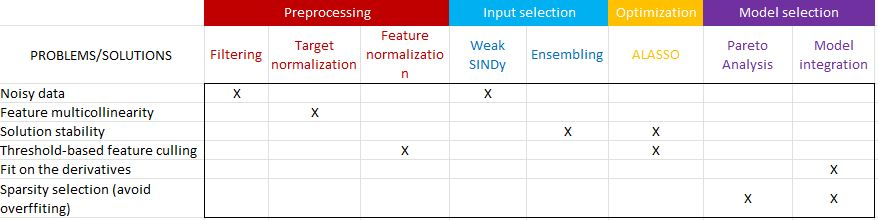

# SINDyEP2
**Implementation of the *Sparse Identification of Nonlinear Dynamics* algorithms as used by UC3M's [EP2 team](https://ep2.uc3m.es/) for solving the inverse problem in Electric Propulsion systems. The focus of our implementation is on finding the true model, rather than the model that best fits the data.**

## Intended workflow
Similar to the original SINDy, the intent is for the process of discovering the system dynamics as follows:
1. Gather time-series for the relevant variables (both the target and the supposed dependencies) from experiment or simulation.
2. Construct library of candidate functionals / features (those expected to govern the dynamics).
3. Compute either the numerical derivative of the target variable (*differential formulation*) or the input's integral forms (*integral formulation*).
4. Use random sampling of points and features to build an ensemble of inputs to feed the algorithm.
5. **RUN SINDy**: solve the linear regression problem $\dot{X} = \Theta(X)\beta$ with sparsity promotion such that the *true model* is returned. 
 
The Adaptive version of the LASSO algorithm (using the reweighted L1 norm to promote sparsity) is used due to its "oracle properties", i.e. guarantee to find the correct support in the asymptotic limit of infinite data. To find the correct sparsity level the whole regularization landscape is explored, and the "knee" of the resulting Pareto front of sparsity vs accuracy is taken as the optimal model.

## Code structure
This repository has three main modules: preprocessing, CORE and analysis.
- *preprocessing* includes functions to transform the inputs (bootstrapping and weak formulation).
- *CORE* contains our implementation of the ALASSO optimizer, the algorithms used to explore the Pareto landscape and the main function.
- *analysis* has functions to print the resulting models, analyze time series dynamics, generate and modify synthetic datasets for testing...

Note that weak forms can be computed with compute_weak_forms (single integration window) or windowed_generation (several randomly selected windows), both in preprocessing/weak_forms.py.

## Code features

